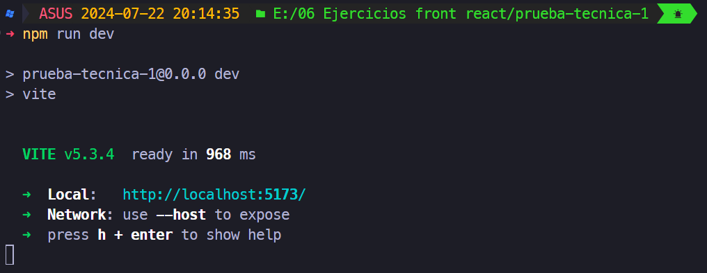

# Prueba técnica 1

Tomada del videotutorial de youtube [Prueba técnica REACT](https://www.youtube.com/watch?v=2Lmz87uYBsw)

## Inicialización del proyecto
Para el presente proyecto se usa Vite para generar el proyecto base a partir de un template de React para Javascript usando el siguiente comando
``` bash
$ npm create vite@latest
```
Se tiene como resultado el proyecto actual que se puede ejecutar ingresando a la carpeta del proyecto y ejecutando el comando
 ``` bash
$ npm install
$ npm run dev
```



## Creando repositorio en GitHub
``` bash
$ git init
$ git add .
$ git commit -m "cargando proyecto base"
$ git branch -M main
$ git remote add origin https://github.com/tu-usuario/tu-proyecto.git
$ git push -u origin main
```