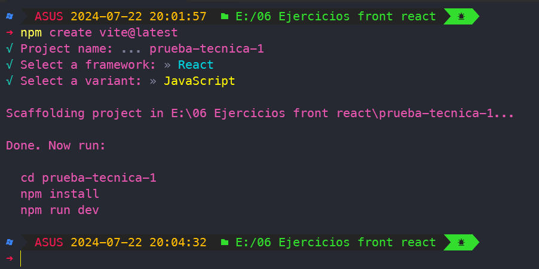

# Prueba técnica 1

Tomada del videotutorial de youtube [Prueba técnica REACT](https://www.youtube.com/watch?v=2Lmz87uYBsw)

## Inicialización del proyecto
Para el presente proyecto se usa Vite para generar el proyecto base a partir de un template de React para Javascript usando el siguiente comando
``` bash
$ npm create vite@latest
```
Se tiene como resultado el proyecto actual que se puede ejecutar ingresando a la carpeta del proyecto y ejecutando el comando
 ``` bash
$ npm install
$ npm run dev
```



## Git y GitHub

### Creando repositorio remoto y subiendo proyecto base a la nube
Una vez creado el proyecto en tu cuenta de Github ejecutar los siguientes pasos para enviar el proyecto a la nube. Tener en cuenta la URL del origen remoto
``` bash
$ git init
$ git add .
$ git commit -m "cargando proyecto base"
$ git branch -M main
$ git remote add origin https://github.com/tu-usuario/tu-proyecto.git
$ git push -u origin main
```

### Creando tags en Git para documentar pasos usando etiquetas anotadas
``` bash
# ver lista de etiquetas
$ git tag

# crear una etiqueta anotada
# -a especifica el nombre de la etiqueta
# -m especifica el detalle o comentario de la etiqueta
$ git tag -a v0.0 -m "versión 0.0: Inicio del tutorial"

# enviar etiqueta al repositorio mediante el nombre de etiqueta
$ git push origin v0.0
# enviar todas las etiquetas que no han sido enviadas aún al repositorio
$ git push origin --tags

# cambiar entre etiquetas
$ git checkout v1.4
```

### Creando ramas
Es buena práctica crear ramas agrupandolas por carpetas, en este caso vamos a usar la agrupación de features como se indica con el siguiente comando
``` bash
$ git checkout -b feature/crear-estado-inicial
```

### Fucionar (Merge) hacia la rama principal
Para este proyecto vamos a usar el método de Squash and merge para mantener la rama main lo más límpia posible y fácil de entender de los pasos que se van realizando
``` bash
# Cambiarse o ubicarse sobre la rama main
$ git checkout main

# Hacer el merge con la opción squash de la rama solicitada.
# Va a tomar todos los commits de la rama y los agrupa en un único commit en la rama destino deseada
$ git merge --squash feature-branch

# Crea un único commit con todos los cambios
# Al no agregar el parámetro -m te permite modificar un mensaje con tódos los mensajes de los commits anteriores
$ git commit

# En el editor hacer los cambios necesrios al mensaje
# Para salir Ctrl+X Ctrl+C
# Luego seguir la instrucción y escribir :qa
# Finalmente enviar los cambios al repositorio remoto
$ git push
```

## Agregar testing a la aplicación

1. Agregar dependencias de desarrollo para unit test
``` bash
$ npm install -D vitest @testing-library/react @testing-library/jest-dom @testing-library/user-event
```

2. Crear el archivo `src/setup-tests.js` con el siguiente contenido
``` js
import '@testing-library/jest-dom'
```

3. Modificar en el archivo `package.json` la sección script para ejecutar los tests
``` JSON
  "scripts": {
    "test": "vitest",
    "coverage": "vitest run --coverage"
  }
```
4. En el archivo `vite.config.js` agregar la sección para los tests
``` js
export default defineConfig({
  plugins: [react()],
  test: {
    globals: true,
    environment: 'jsdom',
    setupFiles: ['./src/setup-tests.js'],
  },
})
```

5. Crear un archivo test `App.test.js` para validar el funcionamiento y correcta configuración
``` js
test('Demo', () => {
    expect(true).toBeTruthy();
})
```

Al ejecutar los test con el comando npm run test se podrá ver el siguiente resultado


Para mayor información con unit test en React se pueden consultar los siguientes links
* [referencia 1](https://jestjs.io/docs/expect)
* [referencia 2](https://testing-library.com/docs/queries/about/#textmatch)
* [referencia 3](https://zaferayan.medium.com/how-to-setup-jest-and-react-testing-library-in-vite-project-2600f2d04bdd)
* [referencia 4](https://medium.com/@masbagaspn/unit-testing-react-application-with-vitest-and-react-testing-library-910f6f4dc675)
* [referencia 5](https://kentcdodds.com/blog/stop-mocking-fetch)